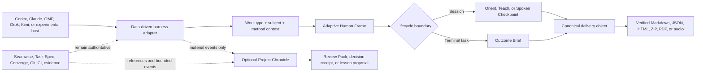

# Architecture

Brief-Spec standardizes how agent work reaches a human; it does not replace the agent's reasoning
or any method's authority.

The Human Frame is the message-level reading fabric. Checkpoints preserve session continuity,
Outcome Briefs close tasks, and the optional Chronicle summarizes project history. Decision packs
and approved lesson exports extend the same evidence discipline without becoming new authorities.
See the complete [examples catalog](examples.md) for every work type, presentation, horizon, and
method-context route.

## Responsibilities

### Host agent

- Performs implementation, investigation, or research.
- Reads the relevant skill.
- Synthesizes the human-facing explanation.
- Selects and cites inspectable evidence.

### Brief-Spec core

- Normalizes provider lifecycle payloads.
- Classifies substantive work locally into one work type and subject.
- Adds bounded Seamwise, Task-Spec, Converge, or general method context where available.
- Records timestamps, counters, event hashes, and pending state.
- Determines checkpoint eligibility.
- Waits for a safe boundary.
- Validates bounded Markdown contracts.
- Requests at most one repair.
- Installs and diagnoses host integrations.

Brief-Spec never calls a model. It does not reconstruct the agent's reasoning or silently make a
second summary of a summary.

## Optional Human Continuity extension

`brief-spec-chronicle` is a separately versioned extension, disabled until explicit project
initialization. Core hooks add bounded method context to substantive explanations where the host
can carry it, but they do not persist the response. Chronicle accepts only explicit material-event
records and stores them outside the repository below the private Brief-Spec state root.

The append-only event segments are the durable observation record. Their hash chain provides
tamper evidence only. The SQLite relation index is derived and rebuildable. Chronicle renderers
consume one canonical snapshot and cannot independently rewrite its project history.

See [Human Continuity Fabric and Project Chronicle](human-continuity.md).

## Event model

Provider events normalize into:

- `session_start`
- `user_prompt`
- `pre_tool` (Grok only, to deliver the classification)
- `post_tool`
- `pre_compact`
- `agent_stop`
- `session_end` (observe-only, including Grok's session-end Stop)
- `subagent_start` and `subagent_stop`
- `error`

Before a prompt is classified, the adapter removes text the host inserted on the user's behalf:
background task notifications, system reminders, slash-command echoes, and hook feedback. A prompt
that contains only such text is not a user turn. It does not count toward checkpoint volume,
reclassify work, request a checkpoint, or select a method.

The internal model includes runtime, opaque session ID, timestamp, working directory, bounded
assistant text when available, transcript reference when available, stop-loop state, counters, and
a canonical payload hash.

Unknown fields are ignored. Unknown or malformed payloads fail open.

## Trigger policy

Elapsed time, turn count, assistant volume, tool count, a manual request, or context compaction can
make a checkpoint eligible. Time and volume are measured inside a window that restarts at every
valid checkpoint or Outcome Brief. Eligibility and delivery are separate:

1. An unsafe event records a pending checkpoint.
2. Active work continues.
3. Under `suggest`, the model receives one suggestion per window at a tool boundary.
4. Under `auto`, or for an explicit request, the next agent-stop boundary requests the checkpoint.
5. Cooldown and minimum-turn rules prevent repetition.
6. A valid terminal Outcome Brief may satisfy an automatic orient checkpoint.

`manual`, `suggest`, and `auto` modes trade automation for interruption risk. `suggest` is the
default.

## Task lifecycle

A task starts when a substantive prompt is classified. The type stays fixed until an explicit
override, a clear pivot, or a valid Outcome Brief. A soft cue such as "now that X is done" switches
the type only when the new prompt classifies as a different, non-fallback type. A valid Outcome
Brief closes the task: the decision stays recorded, a plain follow-up such as "thanks" receives no
guidance, and the next substantive prompt is classified afresh.

Full guidance is sent once per context window. Later prompts in an open task receive a one-line
reminder with the sections and the exact typed marker. Session start and compaction reset the
window. OMP and Grok always receive the full text, because OMP rebuilds its system prompt every
turn and Grok discards prompt-hook output.

## Repair guard

Every stop validates the terminal message, under every policy. The state records whether the last
message carried an Outcome Brief or Checkpoint, whether it was valid, its status, and its first
errors. Claude Code shows a one-line warning when a brief is present but invalid; other hosts keep
the result in state only. A compact `DONE` Outcome (Status, Outcome, Proof) validates and does not
require the typed wrapper, because it is meant for short answers.

In enforce or automatic mode, a known-invalid handoff may block one stop and send a combined repair
instruction to the host. Brief-Spec atomically records the attempt before returning the block. A
second stop is allowed even when invalid. Native `stop_hook_active` signals are honored as an
additional guard.

Hooks are a UX enforcement mechanism, not a security boundary.

## State and privacy

State resolution:

1. `BRIEF_SPEC_HOME`
2. `BRIEFSPEC_HOME` (legacy compatibility)
3. `XDG_STATE_HOME/brief-spec`
4. `~/.local/state/brief-spec`

Doctor continues reading the legacy state directory and migrates receipt-owned state
transactionally when `--fix` is supplied.

Session directory names are SHA-256 hashes of runtime and opaque session ID. Files use private
permissions where supported and atomic replacement. Lock files serialize concurrent event updates.
Corrupt state is quarantined and rebuilt.

Persisted by default:

- provider and opaque session identifiers;
- timestamps and counters;
- checkpoint reasons and mode;
- recent event hashes;
- one-repair state;
- the last brief's kind, validity, status, and validation errors.

Never persisted by default:

- raw prompts;
- full assistant responses;
- transcript contents;
- tool inputs or results;
- environment variables or credentials.

## Installation architecture

The Python wheel force-includes canonical root skills, schemas, hooks, integration templates, and
manifests as package resources. User and project installers materialize those assets, merge hook
configuration, and write a hash-based receipt.

The built-in adapter registry covers Codex, Claude Code, OMP, Grok Build, Kimi Code, GitHub
Copilot, Cursor Agent, and Goose. Capability reports distinguish live-verified adapters from
experimental ones and report the actual delivery tier instead of inferring support from the model
name.

Project-scoped Copilot installation builds a deterministic, stdlib-only `brief-spec.pyz`. The cloud
agent can execute it from the cloned repository without package downloads or outbound network. Its
PascalCase hook configuration is shared by VS Code and the cloud agent; the adapter returns both
the native Copilot fields and the VS Code-compatible envelope where the hosts differ.

Uninstall removes Brief-Spec hook entries and receipt-owned files only. Modified and shared files are
preserved. A runtime installation is transactional: a failed write restores preexisting bytes and
removes partial files before surfacing the error.
